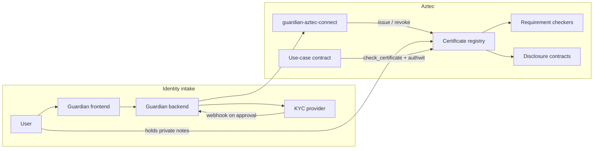
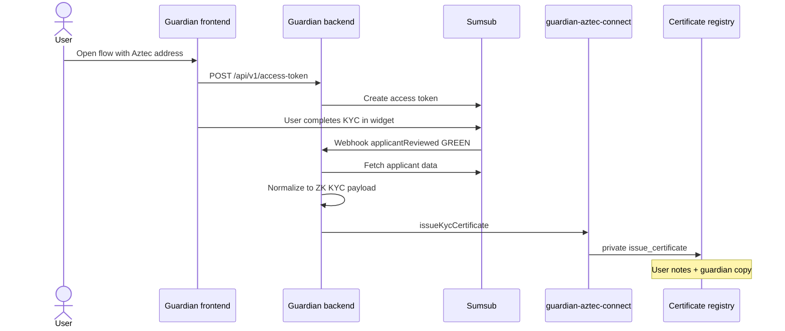

# ZK KYC on Aztec

Technical specification of Galactica’s zero-knowledge KYC system as implemented in this repository.

This document is for community members and partners who want an accurate overview of how the solution works, what properties it provides, and how the pieces fit together. It describes the system as built today on Aztec (Noir contracts, TypeScript services, and the demo app). It is not a protocol-level cryptographic paper and not a deployment runbook.

---

## 1. Introduction

ZK KYC lets a user complete a conventional identity check with a licensed **guardian**, receive a **private on-chain certificate**, and later prove legally relevant facts (for example “over 18” or “not on this sanction list”) to Aztec smart contracts **without publishing identity documents or personal data on-chain**.

The same certificate can optionally **disclose** selected information to chosen counterparties. Disclosure can go to a single recipient, or be split with a threshold scheme so that several parties must cooperate to reconstruct a secret.

Guardians keep the full KYC file off-chain for audits, AML/CTF, and revocation. That off-chain record is the compliance trail regulators expect. On-chain, the network only sees that a whitelisted guardian issued a private certificate, and that the holder can satisfy whatever checks a use-case contract asks for.

The registry is built for KYC first, but the same certificate model can represent other attested credentials (for example education). ZK KYC here is independent of ZK Passport-style document proofs: a guardian attests that a real KYC process happened.

**Stack.** Contracts are written in Noir for Aztec v5. Off-chain services use Node.js and Yarn. Users interact through an Aztec wallet and the Private eXecution Environment (PXE), which generates the proofs that private transactions need.

---

## 2. Goals and properties

| Goal | How the system delivers it |
| --- | --- |
| Legally useful KYC | A guardian runs a real KYC process (the reference path uses Sumsub), stores the file, and attests the result on Aztec. |
| Privacy by default | Certificate and KYC fields live in the user’s private notes. Usage is not visible to the public chain, and the issuing guardian cannot observe later use. |
| Selective compliance proofs | Use-case contracts ask only for the facts they need, via pluggable **requirement checkers** (age, sanctions, and further checkers later). |
| Selective disclosure | Pluggable **disclosure contracts** send private events to chosen recipients, including threshold (Shamir-style) sharing. |
| Revocation | The guardian can revoke a certificate. Private checks read a delayed public revocation flag so they can fail closed after revocation settles. |
| Composability | Any Aztec contract can call the registry with the user’s authorization (authwit) and then run its own business logic. |
| Auditability | The guardian retains the KYC dossier off-chain and a private copy of each issued certificate so they can revoke and account for issuances. |

What this is **not**: a fully trustless identity system. Users and counterparties trust the **whitelisted guardian** for the quality of the KYC, and they trust the **registry admin** for who is allowed to issue. Cryptography then keeps use of a valid certificate private and makes on-chain checks enforceable without leaking the file.

---

## 3. Roles

**User.** Completes KYC with a guardian, holds the private certificate in their Aztec account, and authorizes dApps to check it.

**Guardian.** A KYC provider (or an institution that uses one). They collect and store identity data, issue and revoke certificates on Aztec, and must be on the registry whitelist. They receive a private **copy** of each certificate they issue so they can revoke it later; they do not see how the user spends the original.

**Registry admin.** Deploys the certificate registry and maintains the guardian whitelist (add / remove). Distinct from the guardian’s operational keys.

**Use-case contract.** Any Aztec application that needs a compliance gate: a private transfer, a mint, an institutional product, and so on. The included `UseCaseExample` shows the intended call pattern.

**Disclosure recipient.** An institution, investigator, or other party configured on a disclosure contract. They receive private events when a user opts into (or a use case requires) disclosure.

**KYC provider.** In the reference integration this is Sumsub. Other providers can be adapted as long as their payload is normalized to the same ZK KYC shape before issuance.

---

## 4. Architecture

The system has three layers: identity intake, on-chain certificates, and application use.

**Identity intake** is off-chain. The user opens the guardian frontend with their Aztec address, completes KYC in the provider widget, and the backend waits for an approval webhook.

**Issuance** is an Aztec private transaction from the guardian’s account. It writes a certificate note and KYC content notes into the user’s private state, plus a guardian copy used only for revocation.

**Use** is another private transaction: the dApp calls `check_certificate` with the user’s authorization. The registry confirms the note, the issuing guardian is still whitelisted, and the certificate is not revoked. Optionally it runs a requirement checker and/or a disclosure contract, then returns the notes to the user so the certificate can be reused.

---

## 5. Core concepts

### 5.1 Certificates as private notes

A certificate is not a Merkle leaf or a public NFT. It is an Aztec **private note** owned by the user:

- **issuing guardian** address
- **unique id** — links the certificate to its content notes
- **revocation id** — random identifier used if the guardian later revokes
- **content type** — `1` for ZK KYC; other types are reserved for future credentials

KYC fields sit in separate **content notes** (personal data and address), keyed by `unique_id + index`. Notes are delivered on-chain in constrained (proven) form so the user can discover them in their PXE.

During a check, the registry **pops** the notes, runs the requested checks, and **inserts them again**. The certificate is reusable. Nullifiers from note handling do not reveal which user or which certificate was used.

The guardian’s copy contains the same identifiers but not the KYC content. That is enough to revoke, and not enough to watch the user.

### 5.2 What is stored for KYC

On-chain KYC is a compact, hashed layout — not document scans.

**Personal note**

| Field | On-chain representation |
| --- | --- |
| Surname, forename, middlename | Poseidon2 hash of the UTF-8 string |
| Birthday | Unix timestamp at 00:00 UTC of the birth date |
| Citizenship | Poseidon2 hash of ISO 3166-1 alpha-3 (e.g. `DEU`) |
| Verification level | Integer `0`, `1`, or `2` (approved Sumsub KYC maps to `2`) |

**Address note**

Street and number, postcode, town, optional ISO 3166-2 region, and country — each hashed the same way as the name fields.

Hashing means requirement checkers can compare against public lists (hashed names, hashed country codes) without putting plaintext identity on chain. Birthday stays numeric so an age check can compare it to the block timestamp. The guardian still has the plaintext file off-chain.

### 5.3 Guardian whitelist

Only the registry admin can whitelist or remove guardians. Membership is public, so private issuance and private checks can both assert “this issuer is still allowed.” The contract keeps an iterable list (currently up to 20 guardians) so wallets can discover notes created by known issuers.

If a guardian is removed, certificates they already issued fail subsequent checks. That is the intended kill switch for a compromised or de-authorized issuer.

### 5.4 Revocation

Revocation is a public flag keyed by `revocation_id`, stored in Aztec **delayed public mutable** state with a **12-hour** delay.

Private functions cannot read ordinary public writes from the same transaction in a simple way; delayed public state is the Aztec pattern that lets a later private transaction read a scheduled value. After the delay, `check_certificate` sees the flag and rejects the note.

Until then, a just-revoked certificate might still pass. That window is a protocol trade-off, not an accident. Guardians should treat revocation as “effective after the delay,” not instantaneous.

### 5.5 Requirement checkers

A requirement checker is a small contract with one private entrypoint: given content type and the two KYC notes, **assert the policy** or revert.

The registry does not hard-code age or sanctions. The use-case contract passes the checker address (or zero to skip). That keeps policies upgradeable and lets different products require different facts.

Shipped checkers:

- **Age check** — birthday versus the anchor-block timestamp; default demo threshold is 18.
- **Sanction list** — admin-maintained maps of hashed citizenships and hashed surname+forename pairs. The private check fails if either hits.

New policies (residency, verification level, combination gates) can be added as new contracts that implement the same interface.

### 5.6 Selective disclosure

Disclosure is also pluggable. If the use-case passes a disclosure contract address, the registry forwards owner, context, guardian, unique id, and the content notes. The disclosure contract decides **what** to emit and **to whom**.

- **Basic disclosure** — a private event to one configured recipient: who used which certificate, with a use-case `context` field. It does not dump the KYC file; it creates an auditable link for that recipient.
- **Shamir disclosure** — splits one secret field (currently the hashed surname) into up to eight shards with a configurable threshold (the demo deploys 2-of-3). Each shard is a private event to one recipient. Reconstruction needs at least `threshold` shards; fewer parties learn nothing useful. Coefficients are derived from `context` and `unique_id` so the same certificate does not produce a trivial repeated polynomial.

Threshold disclosure is for **fraud investigation and multi-party access**, not for everyday UX. Ordinary compliance proofs do not need it.

### 5.7 User authorization (authwit)

`check_certificate` runs in the registry but is authorized by the **user**, via Aztec’s authentication witness (`authwit`). The use-case contract is `msg_sender`; the user has signed that this call may consume and restore their certificate notes.

That is the integration seam for partners: deploy your contract, have the wallet produce an authwit for `check_certificate` with your chosen checker and disclosure addresses, then call your private function.

---

## 6. End-to-end flows

### 6.1 KYC and issuance

1. The frontend sends only the user’s Aztec address. That address is the Sumsub external user id, so the webhook can issue without another round trip.
2. The backend verifies the webhook HMAC, ignores non-GREEN reviews, and is **idempotent** (duplicate webhooks do not double-issue).
3. Provider-specific fields are mapped to a **normalized** payload (names, birthday `YYYY-MM-DD`, ISO country codes, address). The Aztec SDK does not speak Sumsub.
4. The SDK hashes string fields, generates `uniqueId` and `revocationId` unless overridden, and submits the private issuance transaction from the guardian account.
5. The backend stores `uniqueId`, `revocationId`, and `txHash` for operations. Encrypted certificate files are **not** uploaded to object storage; the source of truth on-chain is the private notes.

The guardian must already be whitelisted. Issuance fails if they are not, or if the `revocation_id` is already marked revoked.

### 6.2 Proving compliance in a dApp

1. The user connects an Aztec wallet (embedded demo wallet, Azguard, or similar) so their PXE holds the certificate notes.
2. The dApp asks them to authorize `check_certificate` with a nonce and the addresses of the requirement and disclosure contracts (either can be zero).
3. The dApp’s private function calls the registry. The proof shows: a note exists, the issuer is still whitelisted, the revocation flag is false, and any selected checker passed.
4. Application logic runs (transfer, mint, access). Outside observers do not learn which certificate or which identity was used.

The `UseCaseExample` contract is the reference for this pattern.

### 6.3 Disclosure during use

If the use-case passes a disclosure contract, the same private transaction emits recipient-scoped private events. Recipients later decrypt events addressed to them. For Shamir, several recipients combine shards off-chain to recover the secret field.

The demo app includes a Disclosures view that lists basic events and can reconstruct a 2-of-3 Shamir secret from collected shards.

### 6.4 Revocation

The guardian lists their certificate copies (SDK or CLI), then calls `revoke_certificate` with the `revocation_id`. The copy note is consumed so the same id cannot be revoked twice by that guardian. After the delay, user checks fail with “Certificate revoked.”

---

## 7. On-chain components

All of these live under `crates/` and are compiled with `aztec compile` (not raw `nargo compile`).

| Crate | Role |
| --- | --- |
| `zk_certificate` | **Certificate registry**: whitelist, issue, revoke, `check_certificate`, note getters for users and guardians. |
| `zk_certificate_content` | Shared KYC layout constants (field indices, content type). |
| `requirement_checker_interface` | ABI that every checker must match. |
| `age_check_requirement` | Minimum-age checker. |
| `sanction_list_requirement` | Citizenship and name sanction maps. |
| `disclosure_interface` | ABI that every disclosure contract must match. |
| `basic_disclosure` | Single-recipient private event. |
| `shamir_disclosure` | Threshold shards to a recipient set. |
| `use_case_example` | Example consumer of the registry. |

Interfaces exist so the registry can call **any** deployed checker or disclosure contract with a stable signature. Dummy interface bodies are not meant to be called directly.

---

## 8. Off-chain components

### Guardian Aztec Connect (`services/guardian-aztec-connect`)

TypeScript SDK and CLI for guardians:

- load / deploy the guardian Schnorr account
- report whitelist status
- issue a certificate from a normalized KYC JSON
- list revocable copies
- revoke by `revocation_id`

Network selection follows `AZTEC_ENV` (`local-network` or `testnet`) and the JSON files in `config/`. This package is the only place the backend talks to Aztec.

### Guardian backend (`services/guardian-backend`)

HTTP service for the guardian frontend:

- `POST /api/v1/access-token` — `{ "userAddress": "<aztec address>" }` → Sumsub access token
- `POST /api/v1/sumsub-webhook` — HMAC-verified provider events; GREEN review triggers issuance

It keeps an in-process processing record (address, applicant id, status, issuance result). It does not reimplement Ethereum registries, S3 certificate blobs, or email delivery from older stacks.

### Guardian frontend (reference)

`apps/guardian-frontend-reference` is a thin KYC UI: open with `?userAddress=…`, obtain a token, run the Sumsub widget. Wallet connection and certificate download are intentionally out of scope for that app; the user receives the certificate as Aztec notes.

### Demo app (`apps/demo`)

A React app for local network and testnet that shows the full on-chain story: connect a wallet, issue/inspect certificates (including a guardian role), view disclosures, and call the use-case example with chosen checkers and disclosure contracts. It also contains a private stablecoin UI; that product is a **consumer** of privacy on Aztec, not a substitute for the KYC registry. Gating a token with ZK KYC is done with the same `check_certificate` pattern as `UseCaseExample`.

---

## 9. Integrating as a partner

Typical path:

1. Users obtain certificates from a whitelisted guardian (yours, or a Galactica-operated one).
2. You deploy a requirement checker if you need a policy other than the shipped age or sanction checkers, and optionally a disclosure contract.
3. Your Aztec contract stores the registry address (and checker / disclosure addresses if they are fixed) and, in the private function that must be gated, calls `CertificateRegistry.check_certificate` with the user’s authwit.
4. If the call returns, your own logic proceeds.

You do not need to parse KYC notes in your contract unless you are writing a new checker or disclosure module. You also do not put document hashes or Merkle proofs in the transaction: the note **is** the credential.

---

## 10. Privacy, audit, and trust

**Private by default.** Personal data is not in public storage. String fields are hashed. Checks happen in private functions. Guardian copies do not include content notes. Certificate **use** is unlinkable to the guardian on-chain.

**Accountable where the law requires it.** The guardian stores the KYC dossier and issuance identifiers (`uniqueId`, `revocationId`, `txHash`). Disclosure contracts can notify chosen parties. Threshold disclosure raises the bar for abuse: one institution cannot reconstruct the shared secret alone.

**Trust assumptions.**

- Guardians perform KYC honestly and protect their keys and off-chain database.
- The registry admin only whitelists competent guardians.
- Users protect their Aztec account; losing the account means losing access to notes (standard Aztec wallet model).
- Revocation is delayed by design (~12 hours).
- Requirement checkers are only as good as their inputs (for example the sanction maps the checker admin maintains).

**Compared with a public allowlist.** A naive “KYC’d addresses” registry would leak who is onboarded and when they transact. Here, onboarding is a private note, and spending it does not publish a compliance bit to the world.

---

## 11. Repository map

| Path | What it is |
| --- | --- |
| `crates/zk_certificate` | Certificate registry contract |
| `crates/zk_certificate_content` | KYC field layout |
| `crates/age_check_requirement`, `crates/sanction_list_requirement` | Policy checkers |
| `crates/basic_disclosure`, `crates/shamir_disclosure` | Disclosure modules |
| `crates/use_case_example` | Integration example + e2e tests |
| `services/guardian-aztec-connect` | Guardian SDK / CLI |
| `services/guardian-backend` | Sumsub + issuance service |
| `apps/guardian-frontend-reference` | KYC widget frontend |
| `apps/demo` | Interactive Aztec demo |
| `config/` | Local-network and testnet settings |
| `AGENTS.md` | Contributor / tooling notes (Aztec CLI, Node 24, Yarn) |

---

## 12. Current scope

Implemented and exercised in this repo:

- Private certificate issuance and reuse
- Guardian whitelist and delayed revocation
- Age and sanction requirement checkers
- Basic and Shamir disclosure
- Sumsub-backed guardian backend and SDK
- Demo app and Noir / TypeScript tests on Aztec local network (and configurable testnet)

Intentionally not the old design: there is no on-chain Merkle tree of KYC commitments, no indexed Merkle tree for non-revocation proofs, and no mobile “proof of KYC at guardian” circuit. Aztec private notes replace that stack. There is also no downloadable encrypted certificate artifact; holders use notes in their PXE.

The registry’s `content_type` field leaves room for non-KYC credentials; only ZK KYC content notes are issued in the current `issue_certificate` path.
